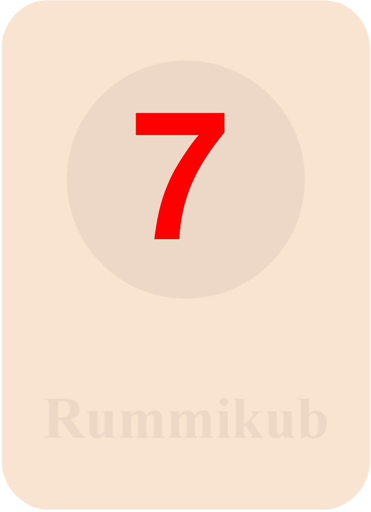

# Rummikub Game Implementation

A comprehensive implementation of the classic Rummikub tile game built with Python and Pygame.


## Game Overview

Rummikub is a tile-based game that combines elements of rummy and mahjong, where players strategically place tiles to form valid sets and aim to be the first to empty their rack. This implementation provides a complete digital experience with intuitive drag-and-drop mechanics, automatic rule validation, and a polished user interface.

### Key Features

- **Complete Rules Implementation**: Authentic Rummikub experience with all official rules
- **Intuitive Tile Management**: Drag-and-drop interface with intelligent tile snapping
- **Advanced Set Validation**: Automatic detection and validation of tile combinations
- **Smart Joker Handling**: Context-aware joker tiles that adapt to their surroundings
- **Game State Management**: Full tracking of gameplay state with move validation
- **Multi-player Support**: Play with 2-4 players (or up to 6 with XP mode)
- **Polished UI**: Clean, responsive interface with visual feedback

## Game Rules

### Objective

Be the first player to play all the tiles from your rack by forming them into valid sets.

### Tile Components

The standard Rummikub set consists of 106 tiles:
- 104 number tiles (1-13 in four colors: red, blue, black, and yellow), with two copies of each

<div style="display: flex; justify-content: center;">
  
  
  
  
  
  
  
  
  
  
  
  
  
</div>
<div style="height: 20px"></div>
<div style="display: flex; justify-content: center;">
  
  
  
  
  
  
  
  
  
  
  
  
  
</div>
<div style="height: 20px"></div>
<div style="display: flex; justify-content: center;">
  
  
  
  
  
  
  
  
  
  
  
  
  
</div>
<div style="height: 20px"></div>
<div style="display: flex; justify-content: center;">
  
  
  
  
  
  
  
  
  
  
  
  
  
</div>
<div style="height: 50px"></div>

- 2 joker tiles (wild cards that can represent any tile)
<div style="display: flex; justify-content: center;">
    
    
</div>
<div style="height: 50px"></div>

### Valid Sets

There are two types of valid sets in Rummikub:

#### Groups
A group consists of **three or four tiles of the same number in different colors**.

<div style="display: flex; justify-content: left;">
  
  
  
</div>
<div style="height: 20px"></div>
<div style="display: flex; justify-content: left;">
  
  
  
  
</div>
<div style="height: 20px"></div>

#### Runs
A run consists of **three or more consecutive numbers all in the same color**.
<div style="display: flex; justify-content: left;">
  
  
  
</div>
<div style="height: 20px"></div>
The number 1 is always the lowest number and cannot follow 13 (no wrapping around).

### Initial Meld

- Each player must make an initial meld of tiles totaling at least 30 points
- These tiles must come from the player's rack and cannot use tiles already on the table
- A joker used in the initial meld scores the value of the tile it represents
<div style="display: flex; justify-content: left;">
  
  
  
</div>
<div style="height: 20px"></div>
<div style="display: flex; justify-content: left;">
  
  
  
</div>
<div style="height: 20px"></div>

### Manipulation

After a player's initial meld, they can manipulate tiles on the table by:

1. **Adding tiles** from their rack to existing sets
2. **Rearranging tiles** already on the table to form new valid sets
3. **Splitting runs** into smaller valid runs
4. **Combining sets** to form new valid arrangements

All manipulations must result in valid sets with no loose tiles left on the table.

#### Manipulation Examples

**Example 1: Adding tiles to sets**

[Manipulation Example 1](path/to/manipulation_example1.png)

**Example 2: Splitting a run**

[Manipulation Example 2](path/to/manipulation_example2.png)

**Example 3: Complex manipulation with multiple sets**

[Manipulation Example 3](path/to/manipulation_example3.png)

### Jokers

- Jokers can substitute for any tile in a set
- A joker's value and color are determined by the set it's placed in
- Players can retrieve a joker by replacing it with the actual tile it represents (from their rack or the table)
- Retrieved jokers must be played in the same turn to form a new set
- Players must use at least one tile from their rack when retrieving a joker
- Jokers cannot be retrieved before a player has made their initial meld

#### Joker Replacement Examples

[Joker Replacement Examples](path/to/joker_examples.png)

### Winning

- The first player to play all tiles from their rack and call "Rummikub!" wins the game
- If there are no more tiles in the pool and no player can make a move, the player with the lowest point value on their rack wins

### Scoring

- After a player wins, other players add up the value of remaining tiles on their racks as negative points
- The winner receives positive points equal to the total of all other players' negative points
- A joker on a rack carries a penalty of 30 points
- The player with the most game wins or highest score after the agreed number of rounds is the overall winner

## Game Screens

### Main Menu

The main menu provides options for starting a new game, configuring settings, and viewing game rules.


**Key Features:**
- New Game button to start a fresh game
- Rules button for accessing game instructions
- Settings for customizing game parameters
- Attractive background and Rummikub branding

### Player Setup

The player setup screen allows configuring player names and the number of players for the game.


**Key Features:**
- Player name input fields
- Player count selection
- Start Game button to begin play
- Visual feedback for valid selections

### Turn Screen

The turn screen displays information about the current player's turn along with game statistics.


**Key Features:**
- Clear indication of the current player
- Game statistics display (turns played, tiles drawn, etc.)
- Start Turn button to begin the player's turn
- Random game tip for strategy guidance

### Game Board

The main gameplay screen with the board, player rack, and game controls.


**Key Features:**
- Drag-and-drop tile manipulation
- Clear visualization of the game board
- Current player's rack
- End Turn button and other controls
- Visual feedback for valid and invalid moves

### End Game

The end game screen displayed when a player wins, showing final scores and stats.

[End Game Screenshot](path/to/end_game_screenshot.png)

**Key Features:**
- Winner announcement
- Score breakdown for all players
- Game statistics summary
- Play Again option
- Return to Main Menu button

## Project Architecture

### Core Components

The implementation follows an object-oriented design with several key components:

#### Tile Class
Represents individual game tiles with properties for value, color, and joker status.

```python
class Tile:
    """Represents a single Rummikub tile."""
    
    def __init__(self, value, color, is_joker=False):
        self.id = str(uuid.uuid4())[:8]  # Unique tile identifier
        self.value = value
        self.color = color
        self.is_joker = is_joker
        self.original_value = value  # For resetting jokers
        self.in_set = False  # Tracks if joker is part of a valid set
        self.rect = pygame.Rect(0, 0, TILE_WIDTH, TILE_HEIGHT)
        self.dragging = False
        self.original_position = (0, 0)
        
    def draw(self, surface):
        """Draw the tile to the provided surface."""
        # Drawing logic here...
```

#### Board Class
Manages the game board state and validates tile arrangements.

```python
class Board:
    """Manages the game board and validates tile arrangements."""
    
    def __init__(self, surface_rect):
        self.rect = surface_rect
        self.tiles = []  # All tiles on the board
        self.current_turn_tiles = []  # Tiles added this turn
        self.valid = True  # Board state validity
        self.grid_size = TILE_WIDTH + TILE_SPACING
        
    def add_tile(self, tile, position):
        """Add a tile to the board at the specified position."""
        # Snap tile to grid
        snapped_pos = self.snap_to_grid(position)
        tile.rect.topleft = snapped_pos
        self.tiles.append(tile)
        self.current_turn_tiles.append(tile)
        
    def validate_board(self):
        """Validate all tile arrangements on the board."""
        # Board validation logic using graph algorithm
```

#### Graph Utility
Implements a graph-based algorithm for identifying connected components and validating sets.

```python
class Graph:
    """Graph utility for identifying connected tile components."""
    
    def __init__(self):
        self.adjacency_list = {}
        
    def add_edge(self, u, v):
        """Add an edge between vertices u and v."""
        if u not in self.adjacency_list:
            self.adjacency_list[u] = []
        if v not in self.adjacency_list:
            self.adjacency_list[v] = []
        
        self.adjacency_list[u].append(v)
        self.adjacency_list[v].append(u)
        
    def find_connected_components(self):
        """Find all connected components using DFS."""
        # Connected components algorithm implementation
```

#### Game Class
Orchestrates game flow, handles player turns, and manages the overall game state.

### Code Organization

```
rummikub/
├── assets/                # Game assets (images, sounds, fonts)
│   ├── images/
│   │   ├── tiles/         # Tile images
│   │   └── ui/            # UI elements
│   └──sounds/            # Game sounds
├── rummikub/              # Core game code
│   ├── __init__.py
│   ├── game.py            # Main game controller
│   ├── board.py           # Game board logic
│   ├── tile.py            # Tile implementation
│   ├── player.py          # Player management
│   ├── utils.py           # Utilities including graph algorithm
│   └── screens/           # UI screens
│       ├── __init__.py
│       ├── menu.py        # Menu screens
│       ├── game_screen.py # Gameplay screen
│       └── turn_menu.py   # Turn management screen
├── main.py                # Entry point
├── requirements.txt       # Dependencies
└── README.md              # This file
```

## Technical Implementation

### Tile Management

Tiles are implemented as objects with properties for value, color, and position. Each tile has a unique identifier, which is crucial for tracking state changes and validating sets.

The drawing system renders tiles with appropriate visual styling based on their attributes:

```python
def draw(self, surface):
    """Draw the tile on the given surface."""
    # Base tile background
    pygame.draw.rect(surface, self.get_background_color(), self.rect)
    
    # Tile border (thicker for jokers)
    border_width = 3 if self.is_joker else 1
    pygame.draw.rect(surface, (0, 0, 0), self.rect, border_width)
    
    # Tile value
    if not self.is_joker:
        font = pygame.font.Font(None, 36)
        text = font.render(str(self.value), True, self.get_text_color())
        text_rect = text.get_rect(center=self.rect.center)
        surface.blit(text, text_rect)
    else:
        # Joker symbol or value based on context
        self.draw_joker(surface)
```

### Graph-Based Set Detection

One of the most innovative aspects of this implementation is the use of graph theory to detect and validate tile sets. The algorithm works as follows:

1. Tiles on the board are represented as nodes in a graph
2. Tiles that are adjacent (within proximity threshold) are connected with edges
3. Kruskal's algorithm finds the Minimum Spanning Forest (MSF) to identify connected components
4. Each connected component is validated as a potential set

[Graph Algorithm Visualization](path/to/graph_visualization.png)

```python
def identify_sets(self, tiles):
    """Use graph algorithm to identify potential sets of tiles."""
    graph = Graph()
    
    # Build the graph based on tile proximity
    for i, tile1 in enumerate(tiles):
        for j, tile2 in enumerate(tiles):
            if i != j and self.are_tiles_adjacent(tile1, tile2):
                graph.add_edge(tile1.id, tile2.id)
    
    # Find connected components (potential sets)
    connected_components = graph.find_connected_components()
    
    # Map component IDs back to actual tile objects
    sets = []
    id_to_tile = {tile.id: tile for tile in tiles}
    
    for component in connected_components:
        tile_set = [id_to_tile[tile_id] for tile_id in component]
        sets.append(tile_set)
    
    return sets
```

#### Connected Components

The graph algorithm efficiently groups tiles into potential sets based on their spatial arrangement on the board:

[Connected Components Example](path/to/connected_components.png)

### Joker Handling

Jokers are a complex aspect of Rummikub, as they dynamically adapt to their context. This implementation uses a context-aware system to determine joker values:

```python
def determine_joker_value(self, joker_tile, tile_set):
    """Determine the appropriate value for a joker based on the set it's in."""
    # Check if it's a group (same value, different colors)
    non_joker_tiles = [t for t in tile_set if not t.is_joker]
    
    if non_joker_tiles:
        # For groups, all non-joker tiles have the same value
        if all(t.value == non_joker_tiles[0].value for t in non_joker_tiles):
            return (non_joker_tiles[0].value, self.find_missing_color(non_joker_tiles))
            
        # For runs, determine the missing value in the sequence
        elif all(t.color == non_joker_tiles[0].color for t in non_joker_tiles):
            values = sorted([t.value for t in non_joker_tiles])
            
            # Find gaps in the sequence
            for i in range(len(values) - 1):
                if values[i+1] - values[i] > 1:
                    # Gap found, joker should be this value
                    return (values[i] + 1, non_joker_tiles[0].color)
                    
            # No gap found, joker is at the start or end
            if min(values) > 1:
                return (min(values) - 1, non_joker_tiles[0].color)
            else:
                return (max(values) + 1, non_joker_tiles[0].color)
    
    return (0, "joker")  # Default if joker's value can't be determined
```

#### Joker Visualization

Jokers are visually distinct and adapt their display based on their current value and color:

[Joker Visualization Examples](path/to/joker_visualization.png)

### Move Validation

The validation system ensures all game rules are followed:

```python
def validate_board(self):
    """Validate the entire board state according to Rummikub rules."""
    # Find all potential sets using graph algorithm
    potential_sets = self.identify_sets(self.tiles)
    
    # Validate each potential set
    for tile_set in potential_sets:
        if not (self.is_valid_group(tile_set) or self.is_valid_run(tile_set)):
            return False, f"Invalid set: {[f'{t.color} {t.value}' for t in tile_set]}"
    
    return True, "Board is valid"

def is_valid_group(self, tiles):
    """Check if tiles form a valid group (same number, different colors)."""
    if len(tiles) < 3 or len(tiles) > 4:
        return False
        
    # Process jokers
    jokers = [t for t in tiles if t.is_joker]
    non_jokers = [t for t in tiles if not t.is_joker]
    
    if not non_jokers:
        return False  # Can't have a group of only jokers
        
    # All non-jokers must have the same value
    value = non_jokers[0].value
    if not all(t.value == value for t in non_jokers):
        return False
        
    # Check for duplicate colors
    colors = [t.color for t in non_jokers]
    if len(colors) != len(set(colors)):
        return False
        
    # With jokers, we need at least 2 actual tiles
    return len(non_jokers) >= 2

def is_valid_run(self, tiles):
    """Check if tiles form a valid run (consecutive numbers, same color)."""
    if len(tiles) < 3:
        return False
        
    # Process jokers
    jokers = [t for t in tiles if t.is_joker]
    non_jokers = [t for t in tiles if not t.is_joker]
    
    if not non_jokers:
        return False  # Can't have a run of only jokers
        
    # All tiles must be the same color
    color = non_jokers[0].color
    if not all(t.color == color for t in non_jokers):
        return False
        
    # Sort by value
    values = sorted([t.value for t in non_jokers])
    
    # Check for gaps that would need jokers
    gaps = 0
    for i in range(len(values) - 1):
        gap_size = values[i+1] - values[i] - 1
        if gap_size > 0:
            gaps += gap_size
            
    # We need enough jokers to fill the gaps
    return gaps <= len(jokers)
```

### UI Implementation

The user interface uses Pygame for rendering and handling interactions, with a custom drag-and-drop system for tile manipulation:

```python
def handle_drag_and_drop(self, events):
    """Handle dragging and dropping of tiles."""
    for event in events:
        if event.type == pygame.MOUSEBUTTONDOWN and event.button == 1:
            # Start dragging
            pos = pygame.mouse.get_pos()
            for tile in reversed(self.all_tiles):  # Check from top to bottom
                if tile.rect.collidepoint(pos):
                    tile.dragging = True
                    tile.original_position = (tile.rect.x, tile.rect.y)
                    self.dragging_tile = tile
                    break
                    
        elif event.type == pygame.MOUSEBUTTONUP and event.button == 1:
            # Stop dragging
            if self.dragging_tile:
                # Check if tile is dropped on the board or rack
                self.handle_tile_drop(self.dragging_tile)
                self.dragging_tile.dragging = False
                self.dragging_tile = None
                
        elif event.type == pygame.MOUSEMOTION:
            # Update position of dragged tile
            if self.dragging_tile:
                mouse_x, mouse_y = event.pos
                self.dragging_tile.rect.x = mouse_x - self.dragging_tile.rect.width // 2
                self.dragging_tile.rect.y = mouse_y - self.dragging_tile.rect.height // 2
```

## Installation and Setup

### Prerequisites

- Python 3.10 or higher
- pip (Python package installer)

### Installation Steps

1. Clone the repository:
   ```bash
   git clone https://github.com/yourusername/rummikub.git
   cd rummikub
   ```

2. Set up a virtual environment (recommended):
   ```bash
   python -m venv venv
   
   # On Windows
   venv\Scripts\activate
   
   # On macOS/Linux
   source venv/bin/activate
   ```

3. Install required dependencies:
   ```bash
   pip install -r requirements.txt
   ```

### Dependencies

```
pygame==2.6.1
pygame-menu==4.5.1
numpy>=1.22.0
pillow>=9.0.0
```

## Usage

### Starting the Game

```bash
python main.py
```

### Game Controls

- **Left Mouse Button**: Select and drag tiles
- **Right Mouse Button**: Cancel selection
- **Space**: End your turn
- **Escape**: Open menu / Return to previous screen
- **S**: Save game
- **R**: Reset turn / Undo changes

## Development Roadmap

- [x] Core game mechanics
- [x] Tile dragging and set validation
- [x] Turn-based gameplay
- [x] Joker implementation
- [ ] AI opponents for single-player mode
- [ ] Network multiplayer support
- [ ] Mobile-responsive UI
- [ ] XP mode for 5-6 players
- [ ] Time limits and tournaments

---

*© 2025 [Your Name/Organization]. All rights reserved.*

*Rummikub® is a registered trademark of Lemada Light Industries Ltd. This implementation is for educational purposes only.*