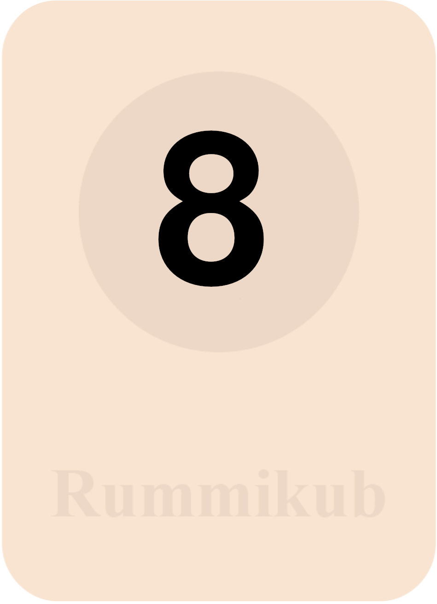
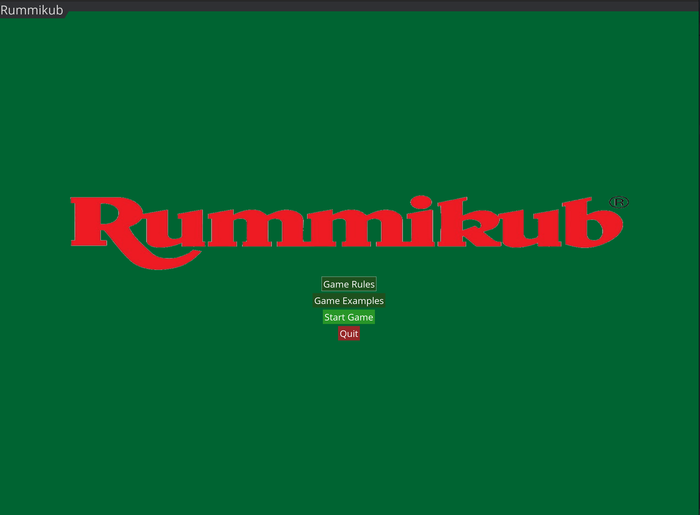

# Rummikub Game Implementation

A comprehensive implementation of the classic Rummikub tile game built with Python and Pygame.


## Game Overview

Rummikub is a tile-based game that combines elements of rummy and mahjong, where players strategically place tiles to form valid sets and aim to be the first to empty their rack. This implementation provides a complete digital experience with intuitive drag-and-drop mechanics, automatic rule validation, and a polished user interface.

### Key Features

- **Complete Rules Implementation**: Authentic Rummikub experience with all official rules
- **Intuitive Tile Management**: Drag-and-drop interface with intelligent tile snapping
- **Advanced Set Validation**: Automatic detection and validation of tile combinations
- **Smart Joker Handling**: Context-aware joker tiles that adapt to their surroundings
- **Game State Management**: Full tracking of gameplay state with move validation
- **Multi-player Support**: Play with 2-4 players (or up to 6 with XP mode)
- **Polished UI**: Clean, responsive interface with visual feedback

### Objective

Be the first player to play all the tiles from your rack by forming them into valid sets.

### Tile Components

The standard Rummikub set consists of 106 tiles, comprising 104 number tiles and 2 joker tiles. The number tiles range from 1 to 13 in four distinct colors (red, blue, black, and yellow), with each number-color combination appearing twice in the set. The joker tiles serve as wild cards that can represent any tile in the game, providing strategic flexibility during gameplay.

<div style="display: flex; justify-content: center;">
  
  
  
  
  
  
  
  
  
  
  
  
  
</div>
<div style="height: 20px"></div>
<div style="display: flex; justify-content: center;">
  
  
  
  
  
  
  
  
  
  
  
  
  
</div>
<div style="height: 20px"></div>
<div style="display: flex; justify-content: center;">
  
  
  
  
  
  
  
  
  
  
  
  
  
</div>
<div style="height: 20px"></div>
<div style="display: flex; justify-content: center;">
  
  
  
  
  
  
  
  
  
  
  
  
  
</div>
<div style="height: 20px"></div>
<div style="display: flex; justify-content: center;">
    
    
</div>
<div style="height: 50px"></div>

### Valid Sets

There are two types of valid sets in Rummikub:

#### Groups
A group consists of **three or four tiles of the same number in different colors**.

<div style="display: flex; justify-content: left;">
  
  
  
</div>
<div style="height: 20px"></div>
<div style="display: flex; justify-content: left;">
  
  
  
  
</div>
<div style="height: 20px"></div>

#### Runs
A run consists of **three or more consecutive numbers all in the same color**.
<div style="display: flex; justify-content: left;">
  
  
  
</div>
<div style="height: 20px"></div>
The number 1 is always the lowest number and cannot follow 13 (no wrapping around).

### Initial Meld

- Each player must make an initial meld of tiles totaling at least 30 points
- These tiles must come from the player's rack and cannot use tiles already on the table
- A joker used in the initial meld scores the value of the tile it represents
<div style="display: flex; justify-content: left;">
  
  
  
</div>
<div style="height: 20px"></div>
<div style="display: flex; justify-content: left;">
  
  
  
</div>
<div style="height: 20px"></div>

### Manipulation

After a player's initial meld, they can manipulate tiles on the table by:

1. **Adding tiles** from their rack to existing sets
2. **Rearranging tiles** already on the table to form new valid sets
3. **Splitting runs** into smaller valid runs
4. **Combining sets** to form new valid arrangements

All manipulations must result in valid sets with no loose tiles left on the table.

### Jokers

- Jokers can substitute for any tile in a set
- A joker's value and color are determined by the set it's placed in
- Players can retrieve a joker by replacing it with the actual tile it represents (from their rack or the table)
- Retrieved jokers must be played in the same turn to form a new set
- Players must use at least one tile from their rack when retrieving a joker
- Jokers cannot be retrieved before a player has made their initial meld

### Winning

- The first player to play all tiles from their rack and call "Rummikub!" wins the game
- If there are no more tiles in the pool and no player can make a move, the player with the lowest point value on their rack wins

### Scoring

- After a player wins, other players add up the value of remaining tiles on their racks as negative points
- The winner receives positive points equal to the total of all other players' negative points
- A joker on a rack carries a penalty of 30 points
- The player with the most game wins or highest score after the agreed number of rounds is the overall winner


# Architecture & Technical Implementation

## Rummikub Directory
```
rummikub/
├── assets/                 # Game assets (images, sounds)
├── screens/                # Screen management modules
│   ├── menu.py             # Menu systems and initial setup
│   └── game_screen.py      # Main gameplay screen
├── board.py                # Board state and set validation
├── deck.py                 # Tile creation and management
├── game.py                 # Main game controller
├── message_system.py       # User feedback notifications
├── player.py               # Player state management
├── theme_manager.py        # UI styling and consistency
├── tile.py                 # Tile objects and behaviors
├── utils.py                # Helper utilities and algorithms
└── main.py                 # Application entry point
```
## Test Directory
```
tests/
├── __init__.py
├── conftest.py                # Shared fixtures and configuration
├── unit/                      # Unit tests for individual components
│   ├── __init__.py
│   ├── test_board.py
│   ├── test_deck.py
│   ├── test_game.py
│   ├── test_message_system.py
│   ├── test_player.py
│   ├── test_theme_manager.py
│   ├── test_tile.py
│   └── test_utils.py
├── integration/               # Tests for component interactions
│   ├── __init__.py
│   ├── test_game_board.py
│   └── test_player_actions.py
└── functional/                # End-to-end gameplay tests
    ├── __init__.py
    └── test_gameplay.py
```

## System Architecture
The Rummikub game is built with a structured, object-oriented architecture using Python and Pygame. The system separates game logic from rendering concerns and employs several design patterns to maintain clean, maintainable code.
```
    ┌─────────────────────────────────────────────┐
    │                   Game                      │
    │  Controls game flow and coordinates modules │
    └─────────────────────┬───────────────────────┘
                          │
    ┌─────────────────────┴─────────────────────────┐
    │                                               │
┌───▼───────────────┐  ┌───────────────────┐  ┌─────▼───────────┐
│  Core Game Logic  │  │    UI Rendering   │  │ Game Screens    │
│ (Board/Deck/Tile) │  │ (Theme/Messages)  │  │ (Menu/GamePlay) │
└───────────────────┘  └───────────────────┘  └─────────────────┘
```

## Key Components
The implementation leverages several design patterns:

1. **Model-View-Controller (MVC)**:
    - **Model**: Game state in Board, Player, and Tile classes
    - **View**: Rendering logic in GameScreen and ThemeManager
    - **Controller**: Game flow management in Game class
2. **Singleton Pattern**:
    - ThemeManager implements a singleton approach for consistent styling
3. **Factory Pattern**:
    - Deck implements factory-like behavior for creating tiles
4. **State Pattern**:
    - Screen transitions implement state-based navigation
5. **Observer Pattern**:
    - Message notification system observes game events

## Implementation Highlights
1. **Optimized algorithms**: Uses NumPy for efficient matrix operations in the Graph class
2. **State preservation**: Maintains game state between turns with position tracking
3. **Error resilience**: Handles invalid moves with clear feedback and recovery options
4. **Extensible design**: Modular architecture allows for feature expansion
5. **Duck typing**: Uses Pythonic programming patterns for flexible object handling
6. **Type hints**: Employs Python type annotations for better code clarity and tooling support

<br>

## Graph-Based Set Detection
The most technically complex aspect is the implementation of a graph-based algorithm for detecting valid Rummikub sets:
```python
class Graph:
    """Optimized adjacency matrix representation of the playing board."""
    # ...
    
    def kruskals_msf(self, active_tiles: dict, max_weight: float):
        """Computes a minimum spanning forest with a max weight threshold."""
        # Algorithm implementation
```
- Uses an **adjacency matrix** representation for spatial relationships between tiles
- Employs **Kruskal's minimum spanning forest algorithm** to identify connected tile sets
- Applies geometric distance calculations to determine tile proximity
- Optimizes tile operations with NumPy arrays for performance


## Menu System Implementation
The menu system (menu.py) provides a comprehensive user interface for game setup and transitions:

```python
class SetupMenu:
    """Initial game setup and home screen with comprehensive game information 
    and visual examples of gameplay elements."""
    
    def __init__(self, game, end_message=None):
        # Initialize menu components
        
    def _create_rules_menu(self):
        """Create the rules page."""
        # Rules menu implementation
```
- **Multi-page design**: Separate pages for rules, examples, and player setup
- **Visual examples**: Demonstrates valid tile sets with visual examples
- **Dynamic content**: Adapts to game state (initial launch vs. end-of-game)
- **Integrated styling**: Uses custom themes from pygame_menu
- **Input validation**: Player name input with validation

## Rendering Pipeline
The rendering system employs a layered approach:
1. **Base layer**: Background colors and board areas
2. **Game elements**: Board tiles and player rack
3. **UI components**: Buttons and status information
4. **Overlay layer**: Messages and highlights

The ThemeManager provides centralized control over visual elements:

```python
@classmethod
def draw_button(cls, surface: pygame.Surface, rect: pygame.Rect, text: str, 
               color_name: str = 'button', text_color: str = 'button_text',
               hover: bool = False) -> None:
    """Draw a themed button on the given surface."""
    # Button rendering implementation
```
- **Consistent styling**: Unified color palette and font settings
- **Dynamic effects**: Hover states and animations
- **Responsive layout**: Adapts to screen dimensions
- **Visual feedback**: Color-coded messages and highlights

## Tile Manipulation System

Tiles implement a comprehensive interaction model:

```python
def start_drag(self, mouse_pos) -> None:
    self.dragging = True
    # Save tiles pre-drag position
    self.pre_drag_pos = self.get_coordinates()
    self.drag_offset = (self.rect.x - mouse_pos[0], self.rect.y - mouse_pos[1])

def update_drag(self, mouse_pos) -> None:
    if self.dragging:
        self.set_coordinates(
            mouse_pos[0] + self.drag_offset[0],
            mouse_pos[1] + self.drag_offset[1]
        )
```
- **Drag and drop**: Intuitive movement of tiles between rack and board
- **Position memory**: Tiles remember their starting position for move reversion
- **Collision detection**: Prevents overlapping tiles
- **Visual feedback**: Highlights valid and invalid placements
- **Snap alignment**: Automatically aligns tiles in valid sets

## Game Rules Enforcement

The code implements complete Rummikub rules:

```python
def validate_turn(self) -> bool:
    """Validate the current player's turn."""
    if len(self.game_screen.board.added_tiles) > 0:
        if self.check_initial_meld():
            if self.game_screen.board.validate_sets():
                return True
    else:
        print('No tiles played.')
    
    self.statistics['invalid_moves'] += 1
    return False
```
- **Initial meld**: 30-point minimum for first play
- **Set validation**: Checks for valid groups (same number, different colors)
- **Run validation**: Checks for valid runs (consecutive numbers, same color)
- **Joker handling**: Special rules for joker substitution
- **Board manipulation**: Allows rearranging existing tiles

## Message Notification System

The MessageSystem provides informative feedback:

```python
class Message:
    """Represents a game message with fade-in/fade-out effects."""
    
    def __init__(self, text: str, duration: float = 3.0, color_name: str = 'text',
                font_name: str = 'normal', position: Tuple[int, int] = None):
        # Message initialization
```
- **Temporal management**: Messages appear and disappear automatically
- **Fade effects**: Smooth transitions with alpha blending
- **Priority queue**: Multiple messages display in sequence
- **Visual styling**: Color-coded by message type (error, success, info)
- **Flexible positioning**: Default or custom message placement

## Statistical Tracking

The game maintains statistical information:

```python
# Add statistics tracking
self.statistics = {
    'turns_played': 0,
    'tiles_drawn': 0,
    'valid_sets_formed': 0,
    'invalid_moves': 0
}
```
- **Game progression**: Tracks turns played and player actions
- **Performance metrics**: Records valid sets and invalid moves
- **Deck status**: Monitors remaining tiles
- **End-game summary**: Provides statistics at game completion

## Audio Feedback System

The game includes sound effects for enhanced player experience:

```python
def load_sounds(self):
    """Load game sound effects."""
    self.sounds = {
        'tile_place': pygame.mixer.Sound('./rummikub/assets/sounds/tile_place.wav'),
        'invalid_move': pygame.mixer.Sound('./rummikub/assets/sounds/invalid_move.wav'),
        'draw_tile': pygame.mixer.Sound('./rummikub/assets/sounds/draw_tile.wav'),
        'valid_set': pygame.mixer.Sound('./rummikub/assets/sounds/valid_set.wav'),
        'win': pygame.mixer.Sound('./rummikub/assets/sounds/win.wav')
    }
```
- **Event-driven**: Sounds tied to specific game actions
- **Graceful degradation**: Falls back silently if sound system unavailable
- **Contextual feedback**: Different sounds for different game states

<br>

## Game Screens

### Main Menu

The main menu provides options for starting a new game, configuring settings, and viewing game rules.


<div style="display: flex; justify-content: left;">
  
  
  
</div>

**Key Features:**
- New Game button to start a fresh game
- Rules button for accessing game instructions
- Settings for customizing game parameters
- Attractive background and Rummikub branding

<br>

### Player Setup

The player setup screen allows configuring player names and the number of players for the game.

<div style="display: flex; justify-content: left;">
    
</div>

**Key Features:**
- Player name input fields
- Player count selection
- Start Game button to begin play
- Visual feedback for valid selections

<br>

### Turn Screen

The turn screen displays information about the current player's turn along with game statistics.

<div style="display: flex; justify-content: left;">
    
</div>

**Key Features:**
- Clear indication of the current player
- Game statistics display (turns played, tiles drawn, etc.)
- Start Turn button to begin the player's turn
- Random game tip for strategy guidance

<br>

### Game Board

The main gameplay screen with the board, player rack, and game controls.

<div style="display: flex; justify-content: left;">
    
</div>

**Key Features:**
- Drag-and-drop tile manipulation
- Clear visualization of the game board
- Current player's rack
- End Turn button and other controls
- Visual feedback for valid and invalid moves

<br>

## Testing the Rummikub Game
This project uses pytest for unit testing, integration testing, and functional testing. The test suite ensures the game components work correctly individually and together.

### Test Structure
Tests are organized into the following directories:
- tests/unit/: Contains unit tests for individual components
- tests/integration/: Contains tests that verify multiple components work together
- tests/functional/: Contains functional tests for higher-level game behavior

### Running Tests

You can run the entire test suite with:
```bash
python run_tests.py
```

Or use pytest directly:
```bash
pytest
```
To run a specific test file:
```bash
pytest tests/unit/test_tile.py
```

To run a specific test:
```bash
pytest tests/unit/test_tile.py::TestTile::test_resize_image
```

<br>

### Test Coverage
I use coverage.py to measure test coverage. Run the tests with coverage:

```bash
pytest --cov=rummikub
```

Generate an HTML coverage report:
```bash
pytest --cov=rummikub --cov-report=html
```

Then open htmlcov/index.html in your browser to view the report.
